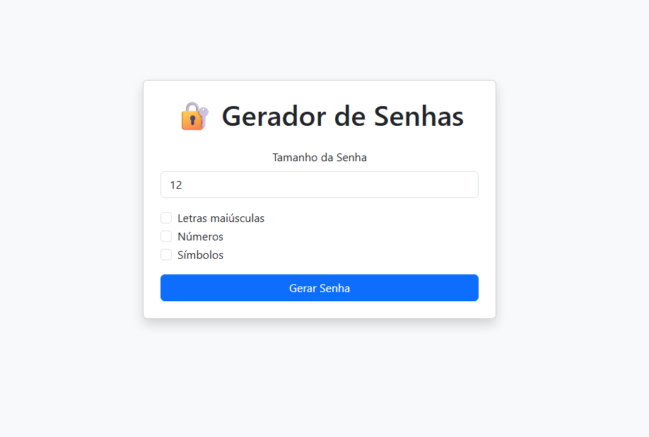

# Portfólio Profissional – João Victor Contarim

Bem-vindo ao meu portfólio pessoal! Este projeto é uma vitrine moderna e profissional desenvolvida para apresentar minha trajetória, habilidades técnicas e os principais projetos em que venho trabalhando.

  

## 🚀 Sobre o Projeto

Este portfólio foi concebido com uma estética **Premium Dark Mode**, focada em legibilidade, performance e uma experiência de usuário fluida. Mais do que uma simples página estática, ele integra elementos dinâmicos e refinações de design para demonstrar atenção aos detalhes.

### Principais Funcionalidades:
- **🎨 Design Premium Dark Mode**: Interface moderna com glassmorphism, sombras suaves e tipografia otimizada.
- **📈 Live Currency Tracker**: Monitoramento em tempo real da cotação USD/BRL integrado diretamente na barra de navegação.
- **📱 Layout Mobile-First**: Experiência totalmente responsiva, com ajustes finos para cada tipo de dispositivo.
- **📄 Premium CV CTA**: Acesso facilitado ao currículo com uma interface de destaque e download direto.
- **🔍 Portfolio Showcase**: Seção de projetos com imagens otimizadas e links diretos para código e demonstrações.

## 🛠️ Tecnologias Utilizadas

O projeto utiliza um stack focado em performance e manutenbilidade:
- **HTML5**: Estrutura semântica e acessível.
- **CSS3 (Vanilla + Bootstrap 5)**: Estilização customizada com variáveis CSS e componentes robustos.
- **JavaScript (ES6+)**: Lógica para interações, animações (AOS) e integração de API externa para cotação.
- **Font Awesome & Google Fonts**: Ícones modernos e tipografia profissional.

## 🎯 Objetivos

1. **Apresentação Profissional**: Demonstrar competência em desenvolvimento web e design de UI.
2. **Centralização de Projetos**: Facilitar o acesso de recrutadores e parceiros aos meus trabalhos.
3. **Evolução Contínua**: Servir como base para a implementação de novas funcionalidades e estudos.

## 🔗 Acesse o Portfólio

Você pode visualizar o projeto online através do GitHub Pages:

  <a href="https://contarim.github.io/Joao-Contarim/" target="_blank" style="padding: 15px 30px; background-color: #dc3545; color: white; text-decoration: none; border-radius: 50px; font-weight: bold;">
    Acessar Portfólio Online
  </a>

---
*Desenvolvido com foco em excelência e inovação por João Victor Contarim.*
